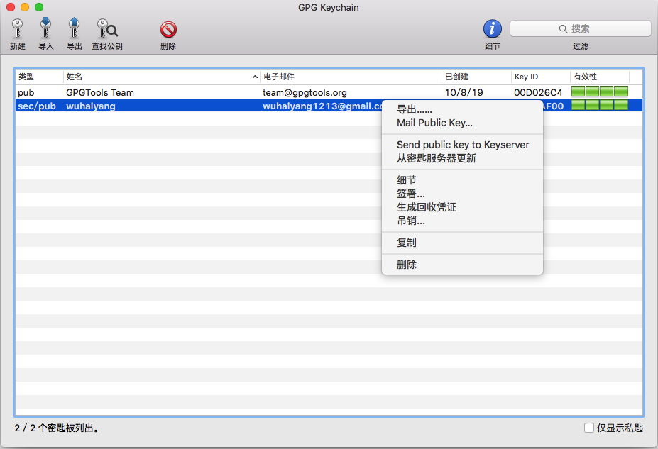
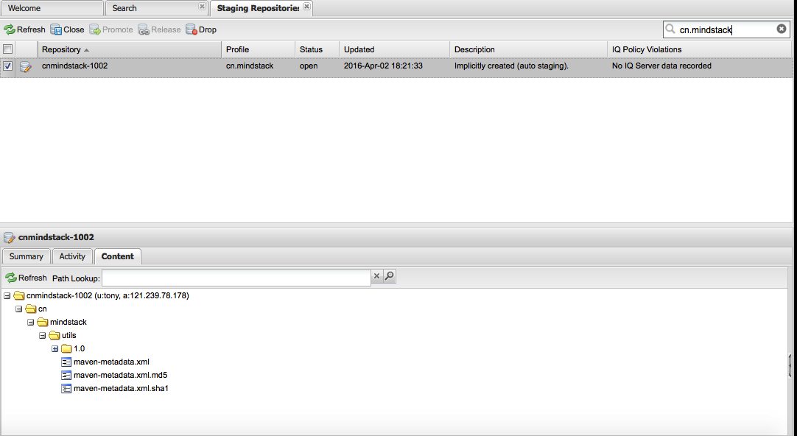

# sonatype
使用Gradle上传jar/aar至Maven

## 准备工作
1. 注册Sonatype帐号
2. 创建一个JIRA ticket

打开[Sonatype JIRA](https://issues.sonatype.org)注册帐号，注册好之后打开[Create Issue](https://issues.sonatype.org/secure/Dashboard.jspa)创建一个JIRA ticket，一个JIRA ticket对应一个项目。

其中Summary填写项目名，例如android dev tips；Description填写项目描述；Group Id必须是项目包名的父级，比如我的包名是cn.mindstack.utils，那么为了我所有的项目都可以发布，Group Id填写为cn.mindstack。

其它按照提示填写，完成后大概两个工作日左右,有时候RP爆发的话第二天就可以了，该issue会变成RESOLVED状态，表示可用，在可用前除了最后一步正式发布之外，其它都可以正常进行。

## 使用GnuPG生成密钥
### 安装
下载地址 [GPG](https://www.gnupg.org/download/index.html)

### 生成密钥对 
#### 命令行下生成密钥对
##### 验证版本
````
$gpg --version

gpg (GnuPG/MacGPG2) 2.0.28
libgcrypt 1.6.3
Copyright (C) 2015 Free Software Foundation, Inc.
License GPLv3+: GNU GPL version 3 or later <http://gnu.org/licenses/gpl.html>
This is free software: you are free to change and redistribute it.
There is NO WARRANTY, to the extent permitted by law.
````
###### 生成密钥
````
$ gpg --gen-key
````
填写相关信息,最后需要输入一个passphrase，妥善保管这个口令，后面配置Gradle脚本时需要用到

##### 查看公钥
````
$ gpg --list-keys

/Users/tony/.gnupg/pubring.gpg
------------------------------
....
pub   4096R/DAE9AF00 2016-03-30 [expires: 2020-03-30]
uid       [ultimate] wuhaiyang <wuhaiyang1213@gmail.com>
uid       [ultimate] [jpeg image of size 8453]
sub   4096R/BF816FAC 2016-03-30 [expires: 2020-03-30]

````
输出的路径为公钥文件，DAE9AF00为keyId，需要上传给服务器

##### 查看私钥
````
gpg --list-secret-keys

Users/tony/.gnupg/secring.gpg
------------------------------
sec   4096R/DAE9AF00 2016-03-30 [expires: 2020-03-30]
uid                  wuhaiyang <wuhaiyang1213@gmail.com>
uid                  [jpeg image of size 8453]
ssb   4096R/BF816FAC 2016-03-30
````
私钥文件路径在配置Gradle脚本时需要用到

##### 上传公钥
````
$ gpg --keyserver hkp://pool.sks-keyservers.net --send-keys DAE9AF00
````

#### MAC生成密钥对
可用GPGKeychain,如图,然后生成的公钥上传至服务器 




## 配置Gradle脚本
Gradle脚本使用了开源项目gradle-mvn-push，Thx Chris大神!

### 添加maven-push.gradle
把下面的脚本复制到工程目录，新建文件maven-push-jar.gradle
````
/*
 * Copyright 2013 Chris Banes
 *
 * Licensed under the Apache License, Version 2.0 (the "License");
 * you may not use this file except in compliance with the License.
 * You may obtain a copy of the License at
 *
 *     http://www.apache.org/licenses/LICENSE-2.0
 *
 * Unless required by applicable law or agreed to in writing, software
 * distributed under the License is distributed on an "AS IS" BASIS,
 * WITHOUT WARRANTIES OR CONDITIONS OF ANY KIND, either express or implied.
 * See the License for the specific language governing permissions and
 * limitations under the License.
 */

apply plugin: 'maven'
apply plugin: 'signing'

def isReleaseBuild() {
    return VERSION_NAME.contains("SNAPSHOT") == false
}

def getReleaseRepositoryUrl() {
    return hasProperty('RELEASE_REPOSITORY_URL') ? RELEASE_REPOSITORY_URL
            : "https://oss.sonatype.org/service/local/staging/deploy/maven2/"
}

def getSnapshotRepositoryUrl() {
    return hasProperty('SNAPSHOT_REPOSITORY_URL') ? SNAPSHOT_REPOSITORY_URL
            : "https://oss.sonatype.org/content/repositories/snapshots/"
}

def getRepositoryUsername() {
    return hasProperty('NEXUS_USERNAME') ? NEXUS_USERNAME : ""
}

def getRepositoryPassword() {
    return hasProperty('NEXUS_PASSWORD') ? NEXUS_PASSWORD : ""
}

afterEvaluate { project ->
    uploadArchives {
        repositories {
            mavenDeployer {
                beforeDeployment { MavenDeployment deployment -> signing.signPom(deployment) }

                pom.groupId = GROUP
                pom.artifactId = POM_ARTIFACT_ID
                pom.version = VERSION_NAME

                repository(url: getReleaseRepositoryUrl()) {
                    authentication(userName: getRepositoryUsername(), password: getRepositoryPassword())
                }
                snapshotRepository(url: getSnapshotRepositoryUrl()) {
                    authentication(userName: getRepositoryUsername(), password: getRepositoryPassword())
                }

                pom.project {
                    name POM_NAME
                    packaging POM_PACKAGING
                    description POM_DESCRIPTION
                    url POM_URL

                    scm {
                        url POM_SCM_URL
                        connection POM_SCM_CONNECTION
                        developerConnection POM_SCM_DEV_CONNECTION
                    }

                    licenses {
                        license {
                            name POM_LICENCE_NAME
                            url POM_LICENCE_URL
                            distribution POM_LICENCE_DIST
                        }
                    }

                    developers {
                        developer {
                            id POM_DEVELOPER_ID
                            name POM_DEVELOPER_NAME
                            email POM_DEVELOPER_EMAIL
                        }
                    }
                }
            }
        }
    }

    signing {
        required { isReleaseBuild() && gradle.taskGraph.hasTask("uploadArchives") }
        sign configurations.archives
    }

    task javadocJar(type: Jar, dependsOn: javadoc) {
        classifier = 'javadoc'
        from tasks.javadoc.destinationDir
    }

    task sourcesJar(type: Jar) {
        from sourceSets.main.allSource
        classifier = 'sources'
    }

    artifacts {
        archives jar

        archives javadocJar
        archives sourcesJar
    }
}
````

maven-push-aar.gradle跟maven-push-jar.gradle大同小异
````
// new task apklib
task apklib(type: Zip){
    appendix = extension = 'apklib'

    from 'AndroidManifest.xml'
    into('res') {
        from 'res'
    }
    into('src') {
        from 'src'
    }
}

artifacts {
    archives androidSourcesJar
    archives androidJavadocsJar
    archives apklib
}
````

## 配置Project属性
在工程目录下的gradle.properties文件中设置属性
````
# Project-wide Gradle settings.

# IDE (e.g. Android Studio) users:
# Gradle settings configured through the IDE *will override*
# any settings specified in this file.

# For more details on how to configure your build environment visit
# http://www.gradle.org/docs/current/userguide/build_environment.html

# Specifies the JVM arguments used for the daemon process.
# The setting is particularly useful for tweaking memory settings.
# Default value: -Xmx10248m -XX:MaxPermSize=256m
# org.gradle.jvmargs=-Xmx2048m -XX:MaxPermSize=512m -XX:+HeapDumpOnOutOfMemoryError -Dfile.encoding=UTF-8

# When configured, Gradle will run in incubating parallel mode.
# This option should only be used with decoupled projects. More details, visit
# http://www.gradle.org/docs/current/userguide/multi_project_builds.html#sec:decoupled_projects
# org.gradle.parallel=true

VERSION_NAME=1.0
VERSION_CODE=1
GROUP=cn.mindstack

POM_DESCRIPTION=sonatype
POM_URL=https://github.com/haiyangwu/sonatype
POM_SCM_URL=https://github.com/haiyangwu/sonatype
POM_SCM_CONNECTION=scm:https://github.com/haiyangwu/sonatype.git
POM_SCM_DEV_CONNECTION=scm:https://github.com/haiyangwu/sonatype.git
POM_LICENCE_NAME=The MIT License
POM_LICENCE_URL=http://mit-license.org
POM_LICENCE_DIST=repo
POM_DEVELOPER_ID=haiyangwu
POM_DEVELOPER_NAME=haiyangwu
POM_DEVELOPER_EMAIL=wuhaiyang1213@gmail.com

SNAPSHOT_REPOSITORY_URL=https://oss.sonatype.org/content/repositories/snapshots
RELEASE_REPOSITORY_URL=https://oss.sonatype.org/service/local/staging/deploy/maven2
````
注意：VERSION_NAME后面加-SNAPSHOT表示发布的是版本快照。

GROUP设置成项目包名，注意，父级要和之前创建JIRA ticket时的Group Id一致。

## 配置Module属性
我们需要给上传的Module配置（我们的工程中可能有多个Module需要上传到仓库中，要给每个Module添加配置）

给需要上传到Maven仓库的Module提供一个gradle.properties文件:
````
POM_NAME=Mindstack Cn Library
POM_ARTIFACT_ID=utils
POM_PACKAGING=jar
````

这个组件对应的依赖已经浮出水面了：GROUP:POMARTIFACTID:VERSION_NAME即
cn.mindstack:utils:1.0

## 配置Module构建脚本
修改Module目录的build.gradle，在最后加上：
````
apply from: '../gradle-publish/maven-push-jar.gradle'
````

## 配置全局属性
这个全局的Gradle配置文件默认在USER_HOME/.gradle/gradle.properties，没有的话可以新建一个

在这里配置Maven服务器的用户名和密码，还需要配置之前生成的keyId, password和一个secretKeyRingFile，这个文件用来在上传release版本时对文件进行签名。

````
signing.keyId=#yourkeyid#
signing.password=#yourpassword#
signing.secretKeyRingFile=#yourkeylocation#/secring.gpg

NEXUS_USERNAME=#yourusername#
NEXUS_PASSWORD=#yourpassword#
````

## 部署release版本
所有的配置已经完成，现在可以上传了，在Terminal输入命令：
````
gradle uploadArchives
````

````
xecuting task ':lib:uploadArchives' (up-to-date check took 0.001 secs) due to:
  Task has not declared any outputs.
Publishing configuration: configuration ':lib:archives'
Publishing to org.gradle.api.publication.maven.internal.deployer.DefaultGroovyMavenDeployer@1d3fb2c1
Deploying to https://oss.sonatype.org/service/local/staging/deploy/maven2
Uploading: cn/mindstack/utils/1.0/utils-1.0.jar to repository remote at https://oss.sonatype.org/service/local/staging/deploy/maven2/
Transferring 1K from remote
Uploaded 1K
Uploading: cn/mindstack/utils/1.0/utils-1.0.pom to repository remote at https://oss.sonatype.org/service/local/staging/deploy/maven2/
Transferring 1K from remote
Uploaded 1K
Uploading: cn/mindstack/utils/1.0/utils-1.0.jar.asc to repository remote at https://oss.sonatype.org/service/local/staging/deploy/maven2/
Transferring 1K from remote
Uploaded 1K
Uploading: cn/mindstack/utils/1.0/utils-1.0-javadoc.jar to repository remote at https://oss.sonatype.org/service/local/staging/deploy/maven2/
Transferring 20K from remote
Uploaded 20K
Uploading: cn/mindstack/utils/1.0/utils-1.0-sources.jar to repository remote at https://oss.sonatype.org/service/local/staging/deploy/maven2/
Transferring 1K from remote
Uploaded 1K
Uploading: cn/mindstack/utils/1.0/utils-1.0-javadoc.jar.asc to repository remote at https://oss.sonatype.org/service/local/staging/deploy/maven2/
Transferring 1K from remote
Uploaded 1K
Uploading: cn/mindstack/utils/1.0/utils-1.0-sources.jar.asc to repository remote at https://oss.sonatype.org/service/local/staging/deploy/maven2/
Transferring 1K from remote
Uploaded 1K
Uploading: cn/mindstack/utils/1.0/utils-1.0.pom.asc to repository remote at https://oss.sonatype.org/service/local/staging/deploy/maven2/
Transferring 1K from remote
Uploaded 1K
Downloading: cn/mindstack/utils/maven-metadata.xml from repository remote at https://oss.sonatype.org/service/local/staging/deploy/maven2/
Could not find metadata cn.mindstack:utils/maven-metadata.xml in remote (https://oss.sonatype.org/service/local/staging/deploy/maven2)
Uploading: cn/mindstack/utils/maven-metadata.xml to repository remote at https://oss.sonatype.org/service/local/staging/deploy/maven2/
Transferring 0K from remote
Uploaded 0K
:lib:uploadArchives (Thread[Daemon worker,5,main]) completed. Took 1 mins 27.062 secs.
````

上传成功后，打开[Sonatype Nexus Professional](https://oss.sonatype.org/#welcome)登录，选择左侧Build Promotion菜单中的Staging Repositories选项，在出现的选项卡右上角的搜索框输入关键字，筛选出你上传的组件所在的repository。


## 正式发布
部署完成之后，上传的组件会存储在一个独立的临时staging repository，在正式发布之前如果你在测试时遇到任何问题，都可以删除这个staging repository，在修复之后重新部署。正式发布才会同步到maven central repository。

通常情况下正式发布操作需要手动完成。

首先打开[Sonatype Nexus Professional](https://oss.sonatype.org/#welcome)登录，打开Staging Repositories列表，筛选出之前部署的repository。

部署完成之后，这个repository会处于Open状态，你可以切换到Content标签页检查这个repository，如果确信没有问题，可以点击列表上面的Close按钮，这样会触发系统对这个repository进行评估。

如果你的组件不满足评估要求，Close操作会失败。

遇到这种情况，可以切换到Activity标签查看系统评估时出现的具体问题，修复问题，再尝试Close操作；如果需要重新部署，可以点击列表上面的Drop按钮删除这个repository，在本地修改之后，再重新部署。

成功close之后，可以点击Release按钮正式发布repository，组件会被移动到OSSRH的release repository，这个仓库会同步到maven central repository。
